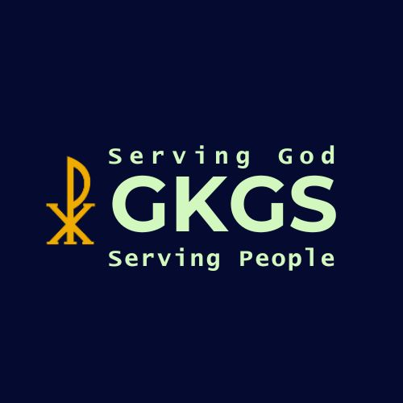

# GKGS APP

<p align="center">
  
</p>

<p align="center">
  <b>Mobile Application for Gereja Kristus Gading Serpong (GKGS)</b>
</p>

---

## About

GKGS App is a mobile application developed for Gereja Kristus Gading Serpong (GKGS) to provide church services in a modern and accessible digital platform.

The application allows congregation members to access church information, participate in spiritual growth programs, record worship attendance through QR Codes, share prayer requests and testimonies, read the Bible digitally, and access digital offering services directly from their mobile devices.

The frontend is built using Flutter, while the backend is developed using NestJS and deployed online. Data is managed through a PostgreSQL database hosted on Supabase.

---

## ⚠️ Technical Disclaimer & Deployment Notes

The **GKGS App** utilizes **Free Tier** cloud development infrastructure for its backend and database deployment. Consequently, users may experience temporary delays or slow data loading times during initial access due to the following technical limitations:

* **Backend Cold Starts (Vercel/Render Free Tier):** Because the backend server is hosted on a free hosting tier, it automatically enters a "sleep" mode after periods of inactivity. Upon opening the application for the first time, the server requires approximately **30–60 seconds** to wake up (*cold start*) before it can process API requests.
* **Database Hibernation (Supabase Free Tier):** The PostgreSQL database on Supabase's free tier may experience intermittent latency or brief pausing if it hasn't been queried recently. Waking up the database instance adds an initial delay to the first data fetch.
* **Bandwidth & Rate Limiting:** Data transfer speeds are subject to the strict bandwidth caps imposed by free-tier cloud providers.

---

## Features

### Home Dashboard

Centralized dashboard providing quick access to all church services available in the application.

### Warta Jemaat

Digital church bulletin containing:

* Weekly announcements
* Church activities
* Service schedules
* Important church information

### Family Altar

Spiritual growth feature that provides:

* Family Altar materials
* Bible references
* Reflection content
* Family devotion resources

### Digital Bible

Built-in Bible reader that allows users to:

* Browse books of the Bible
* Read chapters directly within the application
* Support personal devotion and worship activities

### QR Attendance

Digital attendance system for worship services.

Features include:

* QR Code scanning
* Automatic attendance recording
* Attendance history tracking

### Interaction Board

Community feature where congregation members can share:

* Prayer Requests
* Testimonies

This feature encourages fellowship and mutual spiritual support among church members.

### Digital Offering

Cashless giving feature providing:

* QRIS payment support
* Church offering information
* Easy access to digital giving

### User Profile

Personal account management including:

* User information
* Account details
* Profile management

---


## Technology Stack

### Frontend

* Flutter
* Dart
* Go Router
* Shared Preferences
* Mobile Scanner

### Backend

* NestJS
* TypeScript
* Prisma ORM
* JWT Authentication

### Database

* PostgreSQL

### Deployment

* Vercel (Backend)
* Supabase (Database)

---

## System Architecture

```text
Flutter Mobile Application
            │
            ▼
         REST API
            │
            ▼
      NestJS Backend
        (Vercel)
            │
            ▼
       Prisma ORM
            │
            ▼
 PostgreSQL Database
      (Supabase)
```

---

## Project Structure

```text
GKGS-APP
│
├── gkgs_app/          # Flutter Application
├── gkgs-backend/      # NestJS Backend
├── GKGS.apk           # Android Release APK
└── README.md
```

---

## Installation

### Option 1 — Install APK (Recommended)

The easiest way to try the application is by installing the provided APK.

Steps:

1. Download `GKGS.apk`.
2. Transfer the APK to an Android device.
3. Install the application.
4. Open GKGS App and start using it.

---

### Option 2 — Run from Source Code

Backend and database services are already deployed online.

To run the application locally, only the Flutter project is required.

#### Clone Repository

```bash
git clone https://github.com/JovanSiallagan/GKGS-APP.git
```

#### Navigate to Flutter Project

```bash
cd GKGS-APP/gkgs_app
```

#### Install Dependencies

```bash
flutter pub get
```

#### Run Application

```bash
flutter run
```

The application will automatically connect to the deployed backend and database services.


---

## License

This project was developed for educational purposes and church ministry services at Gereja Kristus Gading Serpong (GKGS).

